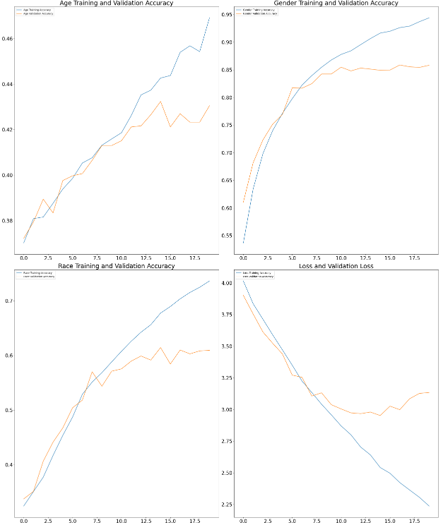
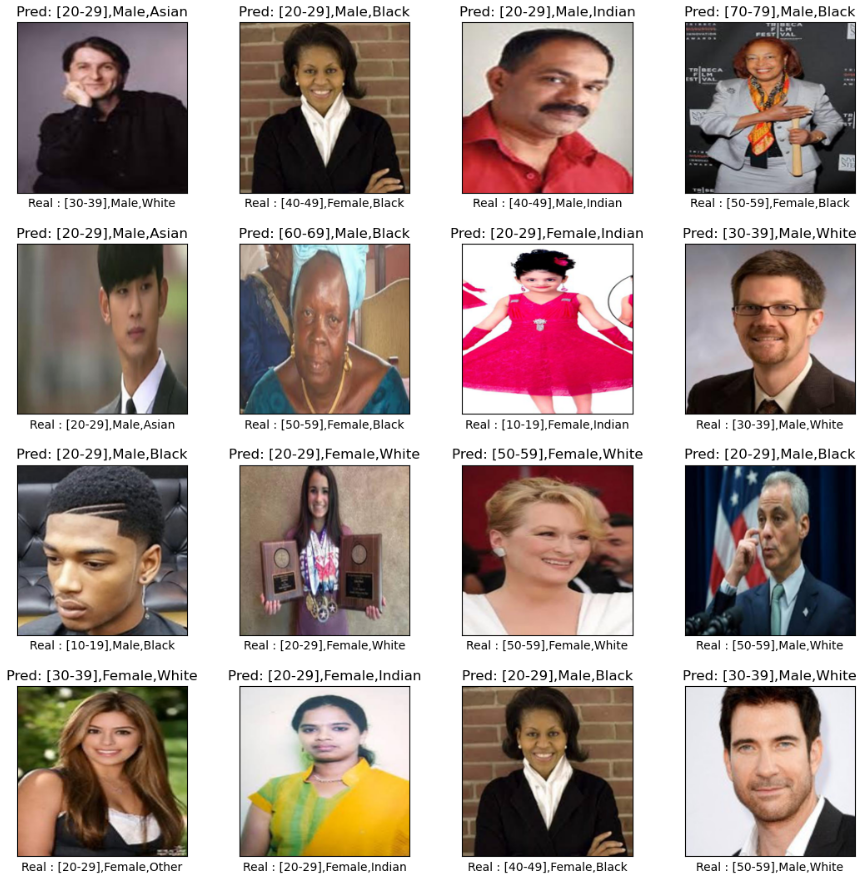

# Age Gender Race Recognition using CNN

This project focuses on recognizing age, gender, and race in images using a CNN model. The model has been trained on a dataset from UTKFACE contains more than 20,000 images. The model is able to recognize races such as White, Black, Indian, Asian, Other, genders male and female and the age of the person from the image.

https://susanqq.github.io/UTKFace/  - Link to the dataset.

## Project description
The project begins with the 'Exploratory data analysis' section aimed at gaining more insights into the dataset: dividing images by gender, age distribution, and the number of images for each race. The next section, 'Data pre-processing', includes: splitting data into training and testing sets, resizing and formatting each image, processing the image into a list of pixels ranging in values [0,1] and creating label arrays.

## CNN Model

This convolutional neural network (CNN) model contains: 

- 6 convolutional layers, each followed by max pooling 
- At the end, there are 3 output layers: 
- Race output layer with softmax activation function 
- Gender output layer with sigmoid activation function 
- Age output layer with softmax activation function

## Results 

